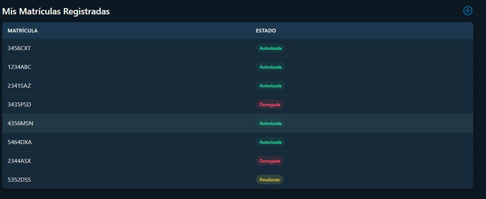
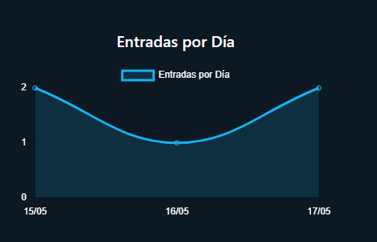
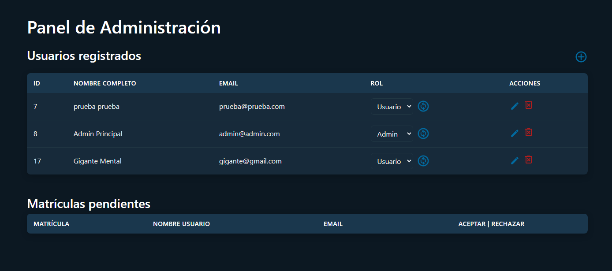
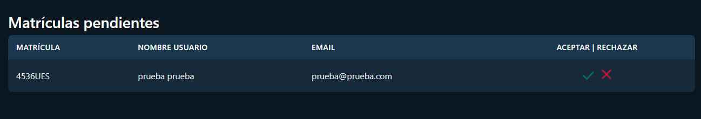

# **Sistema de Control de Acceso por Reconocimiento de Matrículas**

**Autor:** Daniel Serrano Marín

**I.E.S. Francisco Romero Vargas**

**Administración de Sistemas Informáticos en Red**

**Curso: 2024/2025**

---

## Índice

1. [Resumen](#resumen)  
   - [Introducción](#introducción)  
   - [Finalidad](#finalidad)  
   - [Objetivos](#objetivos)  
   - [Medios Utilizados](#medios-utilizados)  
   - [Estructura del repositorio](#estructura-del-repositorio)  

2. [Arquitectura del Sistema](#arquitectura-del-sistema)  
   - [Arquitectura MVC](#arquitectura-mvc)

3. [Componentes del Backend](#componentes-del-backend)  
   - [Sistema de Autenticación](#sistema-de-autenticación)  
   - [Control de acceso basado en roles](#control-de-acceso-basado-en-roles)  
   - [Gestión de Matrículas](#gestión-de-matrículas)

4. [Comunicación en Tiempo Real](#comunicación-en-tiempo-real)  
   - [Visión General](#visión-general)  
   - [Arquitectura de Implementación](#arquitectura-de-implementación)  
   - [Implementación en el Servidor](#implementación-en-el-servidor)  
   - [Implementación en el Cliente](#implementación-en-el-cliente)  
   - [Flujo de Datos del Evento](#flujo-de-datos-del-evento)  
   - [Integración con la Interfaz de Historial](#integración-con-la-interfaz-de-historial)

5. [Interfaz Web](#interfaz-web)  
   - [Para usuarios normales](#para-usuarios-normales)  
   - [Para administradores](#para-administradores)

6. [Componente Raspberry Pi](#componente-raspberry-pi)  
   - [Funcionamiento paso a paso](#funcionamiento-paso-a-paso)  
   - [Reconocimiento de matrícula](#reconocimiento-de-matricula)  
   - [Comunicación con el servidor](#comunicacion-con-el-servidor)  
   - [Repetición automática](#repeticion-automatica)  
   - [¿Cómo se ejecuta automáticamente?](#cómo-se-ejecuta-automáticamente)  
   - [Ventajas de este diseño](#ventajas-de-este-diseño)


---
## **1. Resumen**
### **1.1 Introducción**

Este documento ofrece una visión general completa del sistema **Control Acceso Matrículas**, una solución de control de acceso de vehículos basada en el reconocimiento automático de matrículas. El sistema permite una gestión segura del acceso a instalaciones mediante la captura de imágenes de matrículas con una Raspberry Pi, su procesamiento usando OpenALPR y la verificación de autorización en una base de datos centralizada. Esta página cubre la arquitectura general, los componentes clave, los flujos de trabajo y cómo interactúan dichos componentes.

### **1.2 Finalidad**

El objetivo principal es mejorar la **automatización del acceso** mediante el reconocimiento de matrículas.

#### **Beneficios del sistema:**

- **Acceso automatizado**, eliminando la necesidad de tarjetas o mandos.

- **Mayor seguridad**, permitiendo solo la entrada de vehículos autorizados.

- **Gestión eficiente**, con un sistema centralizado para administrar accesos.

- **Registro detallado** de todos los accesos.

### **1.3 Objetivos**

Desde un punto de vista técnico, el proyecto se centra en:

- **Capturar imágenes de matrículas** con una **cámara en Raspberry Pi 3B**.

- **Detectar matrículas automáticamente** con **OpenALPR**.

- **Almacenar y gestionar matrículas** en una **base de datos MySQL**.

- **Desarrollo un script en Python** que compare matrículas con la base de datos.

- Una **API** con Flask para la gestión de matrículas.

- **Una interfaz web** para que los usuarios puedan solicitar el registro de su matrícula y otra **interfaz web** para administradores.

- **Implementación un panel de administración** donde se aprueben o rechacen matrículas.

### **1.4 Medios Utilizados**

Para llevar a cabo este proyecto, se necesitará:

**Hardware:**

- Raspberry Pi 3B con Ubuntu Server.
    
- Cámara Raspberry Pi HQ.
    
- MicroSD de al menos 16GB con sistema operativo instalado.
    
- VPS en DigitalOcean para alojar la base de datos y la API.
    

**Software:**

- Python, Flask (API), MySQL (base de datos).
    
- OpenALPR para reconocimiento de matrículas.
    
- HTML + Bootstrap + Flask para la interfaz web.
    
- Servidor web.
    

### **1.5 Estructura del repositorio**

```
/control-acceso-matriculas
├── README.md                  # Documentación del proyecto
├── .gitignore                 # Archivos ignorados por Git
├── 📁 canvas/                    # Diagrama de rutas en Obsidian Canvas
│   └── rutasaplicacion.canvas
├── 📁 docs/                     # Documentación técnica
│   ├── 📁 capturas_documentacion/
│   ├── 📁 Raspberry/
│   │   ├── EjecucionAutomaticaScript.md
│   │   ├── ExplicacionProcesarMatricula.md
│   │   └── 📁 OpenALPR/
│   │       └── InstalacionOpenALPR.md
│   └── 📁 VPS/
│       └── DespliegueAplicacionFlaskconGunicorn.md
├── 📁 backend/                  # Aplicación Flask (API y frontend integrado)
│   ├── app.py
│   ├── wsgi.py
│   ├── requirements.txt
│   ├── 📁 routes/               # Blueprints Flask: auth, api, admin, main, matriculas
│   ├── 📁 templates/            # Plantillas HTML
│   ├── 📁 static/               # CSS, iconos, imágenes
│   └── 📁 utils/                # db_utils.py y funciones auxiliares
├── 📁 raspberry-pi/             # Script de captura en Raspberry Pi
│   └── procesar_matricula.py
```

---
## **2. Arquitectura del Sistema**

El sistema _Control Acceso Matrículas_ consta de tres componentes principales:

- **Aplicación Web**: Un servidor basado en Flask que gestiona la autenticación de usuarios, la gestión de matrículas y la lógica de control de acceso.
   
- **Componente Raspberry Pi**: Captura imágenes, procesa las matrículas y se comunica con el servidor.

- **Interfaz de Usuario**: Interfaces web tanto para usuarios normales como para administradores.

### **2.1 Arquitectura MVC**

<details>
<summary>Archivos fuente de esta parte</summary>
<ul>
	<li><a href="backend/routes/auth.py">auth.py</a></li>
	<li><a href="backend/routes/main.py">main.py</a></li>
	<li><a href="backend/templates/index.html">index.html</a></li>
	<li><a href="backend/utils/db_utils.py">db_utils.py</a></li>
</ul>
</details>

El patrón de diseñó utilizado en este proyecto es la arquitectura **MVC** (Modelo-Vista-Controlador). La arquitectura **MVC** es un patrón de diseño muy común en el desarrollo de aplicaciones web, incluido. Divide la lógica de una aplicación en tres componentes separados:

- **Modelos** 
	
	- ¿Qué es?
	
		Representa **los datos** y la lógica de la base de datos de la aplicación.

	- En mi proyecto:
	
		- Se gestiona con funciones de acceso a la [base de datos](db_tfg/control_acceso.sql) en [db_utils.py](backend/utils/db_utils.py).
		    
		- Se encarga de:
		    
		    - Conectarse a MySQL.
		        
		    - Recuperar y guardar información sobre usuarios, matrículas, accesos.
		
		**Ejemplo:**
		
		```python
		def conectar_db():
		
		    return mysql.connector.connect(
		        host="localhost",
		        user="flask_user",
		        password="flask_user",
		        database="control_acceso"
		    )
		```
		
 		> Código extraído del archivo: [db_utils.py](backend/utils/db_utils.py#L6-L12).

- **Vistas**

	- ¿Qué es?
	
		Es la **interfaz visual** con la que interactúa el usuario: HTML, CSS y Flask (Python).
	
	 - En mi proyecto:
	
		- Están en la carpeta [`templates/`](backend/templates/).
		    
		- Se usan con **Jinja2** para insertar dinámicamente datos en las páginas.
		    
		- Muestran matrículas, formularios de login, tablas de usuarios, etc.
		    
	    **Ejemplo:**

		```html
		<h4 class="text-white mb-0">Mis Matrículas Registradas</h4>
		
		  <tr>
		    <td>{{ matricula }}</td>
		    <td>{{ estado }}</td>
		  </tr>
		
		```

 		> Código extraído del archivo: [index.html](backend/templates/index.html#L80-L109).

- **Controladores**

	- ¿Qué es?
	
		Es el **puente entre el Modelo y la Vista**. Gestiona la lógica de la aplicación: recibe peticiones del usuario, actualiza modelos y decide qué vista mostrar.
	
	-  En mi proyecto:
	
		- Están en [`routes/`](backend/routes/): [auth.py](backend/routes/auth.py), [main.py](backend/routes/main.py), [admin.py](backend/routes/admin.py), etc.
		    
		- Cada archivo define rutas (`@app.route`) y qué hacer cuando se accede a ellas.
			
	    **Ejemplo:**

		```python
		@main.route("/")
		@login_required
		def index():
		    conexion = conectar_db()
		    cursor = conexion.cursor()
		...
		```

		> Código extraído del archivo: [main.py](backend/routes/main.py#L12-L16).


---
## **3. Componentes del Backend**

### **3.1 Sistema de Autenticación**

<details>
<summary>Archivos fuente de esta parte</summary>
<ul>
	<li><a href="backend/routes/auth.py">auth.py</a></li>
	<li><a href="backend/templates/base.html">base.html</a></li>
	<li><a href="backend/templates/login.html">login.html</a></li>
	<li><a href="backend/templates/register.html">register.html</a></li>
	<li><a href="backend/utils/db_utils.py">db_utils.py</a></li>
</ul>
</details>
#### Resumen del sistema

El sistema de autenticación gestiona la verificación de identidad de usuarios, mantiene sus sesiones y controla el acceso a las distintas secciones de la aplicación según el rol del usuario (usuario o administrador).

---

#### Modelo de usuario y almacenamiento de datos

Se utiliza una clase personalizada [`User`](backend/utils/db_utils.py#L14-L22) que implementa UserMixin de Flask-Login para representar a los usuarios autenticados. Los datos se almacenan en la tabla [`usuarios`](db_tfg/control_acceso.sql#L87-L97) de la base de datos MySQL.

##### Atributos del modelo [`User`](backend/utils/db_utils.py#L14-L22):

- [`id`](backend/utils/db_utils.py#L16): identificador único
    
- [`nombre`](backend/utils/db_utils.py#L17): nombre del usuario
    
- [`email`](backend/utils/db_utils.py#L18): dirección de correo (para login)
    
- [`password`](backend/utils/db_utils.py#L19): contraseña (hash)
    
- [`matrícula`](backend/utils/db_utils.py#L20): matrícula asociada
    
- [`rol`](backend/utils/db_utils.py#L21): `admin` o `usuario`
	
- [`foto`](backend/utils/db_utils.py#L22): foto del `usuario`


Las contraseñas se almacenan con hash seguro usando [`generate_password_hash`](backend/routes/auth.py#L76), y se verifican con [`check_password_hash`](backend/routes/auth.py#L28).

---

#### Flujo de autenticación

**Inicio de sesión:**

1. El usuario envía email y contraseña al endpoint [`/login`](backend/routes/auth.py#L11-L46).
    
2. El sistema consulta el usuario por email.
    
3. Se compara el hash de la contraseña.
    
4. Si coincide:
    
    - Se inicia sesión con [`login_user()`](backend/routes/auth.py#L36).
        
    - Se guarda el rol en la sesión.
        
    - Se redirige según el rol: dashboard o panel admin.
        

**Registro:**

1. El usuario completa el formulario.
    
2. Se valida:
    
    - Coincidencia de contraseñas.
        
    - Unicidad del email.
        
3. Se guarda el usuario con rol `usuario` y se redirige al login.
    

---

#### Gestión de sesiones

Usa Flask-Login para:

- Verificar si el usuario está autenticado.
    
- Proteger rutas con [`@login_required`](backend/routes/auth.py#L13).
    
- Cerrar sesión correctamente ([`logout_user()`](backend/routes/auth.py#L89-L94)).
    
- Guardar el rol en la sesión para controlar el acceso.
    

---

### **3.2 Control de acceso basado en roles**

Se definen dos roles:

- `usuario`: permisos limitados.
    
- `admin`: acceso completo.
    

Se usa un decorador [`@solo_admin`](backend/routes/admin.py#L66) para:

1. Verificar si el rol en sesión es `admin`.
    
2. Redirigir con error si no lo es.
    
3. Permitir acceso si lo es.
    

#### Rutas protegidas para admin:

- [`/matriculas_admin`](backend/routes/admin.py#L64-L86)

- [`/admin/editar_matricula`](backend/routes/admin.py#L88-L112)

- [`/admin/eliminar_matricula/<int:matricula_id>`](backend/routes/admin.py#L114-L125)

- [`/admin/eliminar_matricula/<id>`](backend/routes/admin.py#L88-L112)

---

#### Integración en la interfaz

**Navegación condicional**

La barra de navegación muestra enlaces distintos según el rol y estado de autenticación.

 **Formularios**

- **Login**: solicita email y contraseña.
    
- **Registro**: incluye nombre, email, contraseña y confirmación.
    

---

#### Funciones de administración

**Crear usuarios**

El administrador puede crear nuevos usuarios desde el panel.

**Editar usuarios**

Puede cambiar nombre, apellidos y email, verificando que no esté duplicado.

---

#### Seguridad

1. **Contraseñas**:
    
    - Hash seguro (Werkzeug).
        
    - Validación en login y registro.
        
2. **Validaciones**:
    
    - Emails únicos.
        
    - Confirmación de contraseña.
        
3. **Sesiones**:
    
    - Se borra todo en logout.
        
    - Decoradores protegen rutas sensibles.

---

### **2. Gestión de Matrículas**

<details>
<summary>Archivos fuente de esta parte</summary>
<ul>
	<li><a href="backend/app.py">app.py</a></li>
	<li><a href="backend/templates/admin_matriculas.html">admin_matriculas.html</a></li>
	<li><a href="backend/templates/solicitar_matricula.html">solicitar_matricula.html</a></li>
</ul>
</details>

El sistema de gestión de matrículas se encarga del ciclo de vida completo de las matrículas de vehículos dentro de la solución de control de accesos. Este módulo administra cómo se solicitan, registran, modifican y autorizan las matrículas, siendo una parte crítica de la infraestructura de acceso de vehículos.

Las matrículas siguen un formato estándar español (4 números y 3 letras, por ejemplo, `1234ABC`) y pueden estar en tres estados:

- **pendiente**
    
- **autorizada**
    
- **denegada**
    

Este documento describe el modelo de datos, el flujo de estados, las operaciones disponibles para el usuario, las funciones administrativas y cómo este subsistema se integra con el resto del sistema.

---

#### Operaciones de usuario

Los usuarios normales pueden:

1. **Solicitar una nueva matrícula**:
    
    - Se valida el formato (regex y validación en HTML).
        
    - Se comprueba si ya está registrada.
        
    - Se guarda con estado `pendiente`.
        
2. **Visualizar sus matrículas**:
    
    - Número de matrícula
        
    - Estado actual
        
    - Acciones disponibles (según estado)
        
3. **Cancelar solicitudes pendientes**
    
4. **Eliminar matrículas denegadas o pendientes**
    

Regex del formato aceptado: `\d{4}[A-Z]{3}` (ejemplo: `1234ABC`)

---

#### Operaciones administrativas

Los administradores tienen funciones ampliadas:

- Ver y gestionar **todas** las matrículas del sistema
    
- Filtrar por estado o usuario
    
- Aprobar o denegar solicitudes
    
- Editar matrículas autorizadas
    
- Eliminar matrículas obsoletas
    
- Añadir matrículas directamente (ya autorizadas)
    
#### Integración con el sistema de control de accesos

Cuando una matrícula es detectada:

1. La Raspberry Pi la envía al endpoint [`/recibir_matricula`](backend/routes/api.py#L11-L94)
    
2. El sistema consulta su estado
    
3. Solo si es `autorizada`, se concede el acceso
    
4. Se registra el intento
    
5. Se emite un evento WebSocket en tiempo real
   
#### Seguridad y validaciones

- Todas las operaciones requieren usuario autenticado
    
- Las validaciones se aplican en:
    
    - Cliente
        
    - Servidor
        
    - Detección de duplicados
        
    - Comprobación de roles


---

## **4 Comunicación en Tiempo Real**

<details>
<summary>Archivos fuente de esta parte</summary>
<ul>
	<li><a href="backend/app.py">app.py</a></li>
	<li><a href="backend/templates/historial.html">historial.html</a></li>
</ul>
</details>


Este documento describe el sistema de comunicación en tiempo real usado en la aplicación Control Acceso Matrículas. Detalla cómo se implementa la tecnología WebSocket para proporcionar actualizaciones instantáneas sobre eventos de acceso de matrículas a los clientes conectados, sin necesidad de refrescar la página.

---

### 4.1 Visión General

El sistema usa WebSockets (mediante Socket.IO) para enviar en tiempo real los eventos de acceso por matrícula a los clientes web. Esto permite a los administradores y usuarios monitorizar intentos de acceso en el momento en que ocurren, sin tener que recargar la página de historial.

---

### 4.2 Arquitectura de Implementación

El sistema de comunicación en tiempo real se compone de:

1. **Servidor**: Aplicación Flask con integración de Socket.IO para emitir eventos.
    
2. **Cliente**: Cliente JavaScript de Socket.IO que se conecta al servidor y actualiza la interfaz según los eventos.
    

---

### 4.3 Implementación en el Servidor

#### Inicialización de Socket.IO

```python
app = Flask(__name__) 
app.secret_key = "clave_segura" 
socketio = SocketIO(app)
```

> Código extraído del archivo: [app.py](backend/app.py#L6-L10).

Se utiliza el objeto `socketio` para emitir eventos y correr la aplicación Flask con soporte WebSocket.

Cuando se recibe una matrícula desde la Raspberry Pi, se emite un evento `nuevo_acceso` con los datos:

```python
socketio.emit(f"nuevo_acceso_{usuario_id}", {
    "matricula": matricula,
    "estado": estado,
    "fecha": fecha_actual,
    "imagen": nombre_imagen,
    "usuario_id": usuario_id
})
```

> Código extraído del archivo: [api.py](backend/routes/api.py#L73-L79).

---

### 4.4 Implementación en el Cliente

#### Conexión WebSocket (cliente JS)

```javascript
const socket = io({
  path: "/socket.io",
  transports: ["websocket"]
});
```

> Código extraído del archivo: [historial.html](backend/templates/historial.html#L101-L104).

Se configura para usar solo WebSocket.

#### Indicador de Conexión

```html
<h2 class="mb-4 text-white">
	Historial de Accesos
	<span id="estado-ws" class="badge connection-badge bg-secondary">
	Conectando...
	</span>
</h2>
```

> Código extraído del archivo: [historial.html](backend/templates/historial.html#L7-L10).

Actualizado por JavaScript:

```javascript
socket.on("connect", () => {
  estadoWS.textContent = "🟢 Conectado";
  estadoWS.className = "badge connection-badge bg-success";
});

socket.on("disconnect", () => {
  estadoWS.textContent = "🔴 Desconectado";
  estadoWS.className = "badge connection-badge bg-danger";
});
```

> Código extraído del archivo: [historial.html](backend/templates/historial.html#L106-L114).

Escucha de eventos:

```javascript
socket.on(canal, (acceso) => {

	const fila = document.createElement("tr");
	...
```

> Código extraído del archivo: [historial.html](backend/templates/historial.html#L116-L159).

### 4.5 Flujo de Datos del Evento

1. La Raspberry Pi detecta una matrícula y envía un POST a `/recibir_matricula`
    
2. El servidor valida la matrícula y registra el acceso
    
3. Se emite el evento `nuevo_acceso` con los datos del intento
    
4. Los clientes conectados reciben el evento y actualizan la interfaz

---
### 4.6 Integración con la Interfaz de Historial

- **Indicador de conexión WebSocket**: Muestra si está conectado
    
- **Actualización dinámica de la tabla**: Nuevos accesos se agregan al principio sin recargar
    
- **Estilos visuales según estado**: Se colorea y etiqueta según esté autorizado, pendiente o denegado

---
## **5. Interfaz web**

<details>
<summary>Archivos fuente de esta parte</summary>
<ul>
	<li><a href="backend/templates/base.html">base.html</a></li>
	<li><a href="backend/templates/index.html">index.html</a></li>
	<li><a href="backend/templates/historial.html">historial.html</a></li>
	<li><a href="backend/templates/admin_panel.html">admin_panel.html</a></li>
	<li><a href="backend/templates/admin_matriculas.html">admin_matriculas.html</a></li>
</ul>
</details>

La interfaz de usuario está desarrollada con HTML, CSS (combinándolo con Bootstrap también), y el motor de plantillas Jinja2 integrado en Flask. Su diseño adapta dinámicamente los elementos mostrados según el rol del usuario: `admin` o `usuario`.

---
### 5.1 Para usuarios normales

- Página principal ([`/`](backend/routes/main.py#L12-L71)) que muestra un resumen de sus matrículas registradas, divididas por estado ([`autorizadas`](backend/routes/main.py#L26-L32), [`pendientes`](backend/routes/main.py#L42-L48), [`denegadas`](backend/routes/main.py#L34-L40)).

	

- Un gráfico con sus accesos diarios, generado con **Chart.js**.

	

	- Código del gráfico:
	
	```html
	<script>
	const ctxEntradas = document.getElementById('graficoEntradas').getContext('2d');
	
	new Chart(ctxEntradas, {
	
	  type: 'line',
	  data: {
	    labels: {{ fechas|tojson }},
	
	    datasets: [{
	      label: 'Entradas por Día',
	      data: {{ cantidades|tojson }},
	      fill: true,
	      backgroundColor: 'rgba(20, 179, 242, 0.15)',
	      borderColor: '#14b3f2',
	      tension: 0.4
	    }]
	
	  },
	
	  options: {
	    responsive: true,
	
	    plugins: {
	      legend: { labels: { color: 'white' } },
	      title: { display: false }
	    },
	
	  scales: {
	    x: { ticks: { color: '#fff' } },
	
	    y: {
	      beginAtZero: true,
	
	      ticks: {
	        color: '#fff',
	        stepSize: 1,
	        callback: function(value) {
	          return Number.isInteger(value) ? value : null;
	        }
	      }
	    }
	  }
	  }
	});
	</script>
	```
	
	> Código extraído del archivo: [index.html](backend/templates/index.html#L215-L251).


- Formulario para solicitar nuevas matrículas.

	

	- Código del backend para solicitar matricula:

	```python
	@matriculas.route('/solicitar_matricula', methods=['GET', 'POST'])
	@login_required
	def solicitar_matricula():
		...
	```
	> Código extraído del archivo: [matriculas.py](backend/routes/matriculas.py#L21-L78).

- [Página de historial](backend/templates/historial.html) con filtros de fechas y visualización de imágenes asociadas a cada acceso.

	
	
---
### 5.2 Para administradores

- Acceso a [`/admin`](backend/routes/admin.py) con un panel que muestra todos los usuarios registrados y todas las matrículas del sistema.

	 

	


- Tabla de matrículas pendientes con botones para aprobar o rechazar solicitudes.

	


- Vistas filtradas y editables de matrículas existentes.
- Modales para crear [nuevos usuarios](backend/templates/admin_panel.html#L100-L131) y [editar usuarios existentes](backend/templates/admin_panel.html#L133-L171).
- Botones de acción rápida para [gestionar roles](backend/routes/admin.py#L20-L39), [limpiar historial](backend/routes/admin.py#L175-L189), o [eliminar registros](backend/routes/admin.py#L114-L125).

---
## **6. Componente Raspberry Pi**

<details>
<summary>Archivos fuente de esta parte</summary>
<ul>
	<li><a href="docs/Raspberry/ExplicacionProcesarMatricula.md">ExplicacionProcesarMatricula.md</a></li>
	<li><a href="docs/Raspberry/OpenALPR/ExplicacionProcesarMatricula.md">InstalacionOpenALPR.md</a></li>
	<li><a href="raspberry-pi/procesar_matricula.py">procesar_matricula.py</a></li>
</ul>
</details>

Es el **sensor inteligente del sistema**. Se encarga de capturar la matrícula de un vehículo en tiempo real y comunicarse con el servidor para validar el acceso.
### 6.1 Funcionamiento paso a paso

- La Raspberry Pi utiliza una [cámara](https://www.amazon.es/dp/B081Q8ZT9J) conectada físicamente.
    
- El script [procesar_matricula.py](raspberry-pi/procesar_matricula.py) ejecuta continuamente este comando:

```python
fswebcam -r 1280x720 --no-banner {CAPTURA}
```

> Código extraído del archivo: [procesar_matricula.py](raspberry-pi/procesar_matricula.py#L12).

Y con ese comando, se guarda una imagen de la matricula que está frente a la cámara.

### 6.2 Reconocimiento de matrícula

- Se analiza la imagen usando **OpenALPR**, un sistema de reconocimiento automático de matrículas.

```python
resultado = subprocess.run(["alpr", "-c", "eu", imagen], capture_output=True, text=True)
```

> Código extraído del archivo: [procesar_matricula.py](raspberry-pi/procesar_matricula.py#L16).

OpenALPR detecta si hay una matrícula en la imagen y extrae el texto, por ejemplo `1234ABC`.

### 6.3 Comunicación con el servidor

- Si se detecta una matrícula válida, la Raspberry Pi **envía la matrícula y la imagen** al servidor web (Flask) mediante una petición **HTTP POST**:

```python
SERVIDOR="https://matriculas.dsermar0808.tech/recibir_matricula"
...
respuesta = requests.post(SERVIDOR, files=archivos, data=datos, timeout=5)
```

> Código extraído del archivo: [procesar_matricula.py](raspberry-pi/procesar_matricula.py#L27).

El servidor se encarga de comprobar si esa matrícula está autorizada o no.

### 6.4 Repetición automática

- Este proceso se ejecuta [cada segundo](raspberry-pi/procesar_matricula.py#L53) en un bucle infinito.

- También se evita repetir matrículas si son consecutivas.

```python
if matricula_detectada:

	print(f"🚗 Matrícula detectada: {matricula_detectada}")

	if matricula_detectada != ultima_matricula:
		enviar_matricula(matricula_detectada, imagen)
		ultima_matricula = matricula_detectada
	else:

		print("⏩ Matrícula repetida, no se envía de nuevo.")

	
else:
	print("⚠️ No se detectó ninguna matrícula.")
	ultima_matricula = None
```

> Código extraído del archivo: [procesar_matricula.py](raspberry-pi/procesar_matricula.py#L42-L51).

### 6.5 ¿Cómo se ejecuta automáticamente?

Se configura como **servicio `systemd`**, es decir, se inicia solo cuando se enciende la Raspberry.

Este es el archivo de configuración [matricula.service](systemd/matricula.service).

```service
[Unit]
Description=Script de detección de matrículas
After=network.target

[Service]
ExecStart=/usr/bin/python3 /home/dsermar/control-acceso-matriculas/raspberry-pi/procesar_matricula.py
WorkingDirectory=/home/dsermar/control-acceso-matriculas/raspberry-pi
StandardOutput=append:/var/log/matricula.log
StandardError=append:/var/log/matricula.log
Restart=always
User=dsermar

[Install]
WantedBy=multi-user.target
```

### 6.6 Ventajas de este diseño

- **Descentralizado**: la Raspberry Pi toma decisiones rápidamente sin depender de cámaras IP complejas.
    
- **Flexible**: puedes cambiar la lógica del servidor sin tocar el script.
    
- **Escalable**: puedes añadir más Raspberrys en otras entradas fácilmente.


