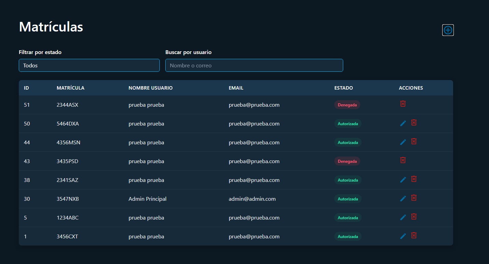

# **Sistema de Control de Acceso por Reconocimiento de Matrículas**

**Autor:** Daniel Serrano Marín

**I.E.S. Francisco Romero Vargas**
**Administración de Sistemas Informáticos en Red**
**Curso: 2024/2025**

## **Resumen**
### **1. Introducción**

Este documento ofrece una visión general completa del sistema **Control Acceso Matrículas**, una solución de control de acceso de vehículos basada en el reconocimiento automático de matrículas. El sistema permite una gestión segura del acceso a instalaciones mediante la captura de imágenes de matrículas con una Raspberry Pi, su procesamiento usando OpenALPR y la verificación de autorización en una base de datos centralizada. Esta página cubre la arquitectura general, los componentes clave, los flujos de trabajo y cómo interactúan dichos componentes.

### **2. Finalidad**

El objetivo principal es mejorar la **automatización del acceso** mediante el reconocimiento de matrículas.

#### **Beneficios del sistema:**

- **Acceso automatizado**, eliminando la necesidad de tarjetas o mandos.

- **Mayor seguridad**, permitiendo solo la entrada de vehículos autorizados.

- **Gestión eficiente**, con un sistema centralizado para administrar accesos.

- **Registro detallado** de todos los accesos.


### **3. Objetivos**

Desde un punto de vista técnico, el proyecto se centra en:

- **Capturar imágenes de matrículas** con una **cámara en Raspberry Pi 3B**.

- **Detectar matrículas automáticamente** con **OpenALPR**.

- **Almacenar y gestionar matrículas** en una **base de datos MySQL**.

- **Desarrollo un script en Python** que compare matrículas con la base de datos.

- Una **API** con Flask para la gestión de matrículas.

- **Una interfaz web** para que los usuarios puedan solicitar el registro de su matrícula y otra **interfaz web** para administradores.

- **Implementación un panel de administración** donde se aprueben o rechacen matrículas.


### **4. Medios Utilizados**

Para llevar a cabo este proyecto, se necesitará:

**Hardware:**

- Raspberry Pi 3B con Ubuntu Server.
    
- Cámara Raspberry Pi HQ.
    
- MicroSD de al menos 16GB con sistema operativo instalado.
    
- VPS en DigitalOcean para alojar la base de datos y la API.
    

**Software:**

- Python, Flask (API), MySQL (base de datos).
    
- OpenALPR para reconocimiento de matrículas.
    
- HTML + Bootstrap + Flask para la interfaz web.
    
- Servidor web.
    

### **5. Estructura del repositorio**

```
/control-acceso-matriculas
├── README.md                  # Documentación del proyecto
├── .gitignore                 # Archivos ignorados por Git
├── 📁 canvas/                    # Diagrama de rutas en Obsidian Canvas
│   └── rutasaplicacion.canvas
├── 📁 docs/                     # Documentación técnica
│   ├── 📁 capturas_documentacion/
│   ├── 📁 Raspberry/
│   │   ├── EjecucionAutomaticaScript.md
│   │   ├── ExplicacionProcesarMatricula.md
│   │   └── 📁 OpenALPR/
│   │       └── InstalacionOpenALPR.md
│   └── 📁 VPS/
│       └── DespliegueAplicacionFlaskconGunicorn.md
├── 📁 backend/                  # Aplicación Flask (API y frontend integrado)
│   ├── app.py
│   ├── wsgi.py
│   ├── requirements.txt
│   ├── 📁 routes/               # Blueprints Flask: auth, api, admin, main, matriculas
│   ├── 📁 templates/            # Plantillas HTML
│   ├── 📁 static/               # CSS, iconos, imágenes
│   └── 📁 utils/                # db_utils.py y funciones auxiliares
├── 📁 raspberry-pi/             # Script de captura en Raspberry Pi
│   └── procesar_matricula.py
```

## **Arquitectura del Sistema**

El sistema _Control Acceso Matrículas_ consta de tres componentes principales:

- **Aplicación Web**: Un servidor basado en Flask que gestiona la autenticación de usuarios, la gestión de matrículas y la lógica de control de acceso.
   
- **Componente Raspberry Pi**: Captura imágenes, procesa las matrículas y se comunica con el servidor.

- **Interfaz de Usuario**: Interfaces web tanto para usuarios normales como para administradores.

### **1. Arquitectura MVC**

El patrón de diseñó utilizado en este proyecto es la arquitectura **MVC** (Modelo-Vista-Controlador). La arquitectura **MVC** es un patrón de diseño muy común en el desarrollo de aplicaciones web, incluido. Divide la lógica de una aplicación en tres componentes separados:

- **Modelos** 
	
	- ¿Qué es?
	
		Representa **los datos** y la lógica de la base de datos de la aplicación.

	- En mi proyecto:
	
		- Se gestiona con funciones de acceso a la [base de datos](db_tfg/control_acceso.sql) en [db_utils.py](backend/utils/db_utils.py).
		    
		- Se encarga de:
		    
		    - Conectarse a MySQL.
		        
		    - Recuperar y guardar información sobre usuarios, matrículas, accesos.
		
		**Ejemplo:**
		
		```python
		def conectar_db():
		
		    return mysql.connector.connect(
		        host="localhost",
		        user="flask_user",
		        password="flask_user",
		        database="control_acceso"
		    )
		```
		
 		> Código extraído del archivo: [db_utils.py](backend/utils/db_utils.py#L6-L12).

- **Vistas**

	- ¿Qué es?
	
		Es la **interfaz visual** con la que interactúa el usuario: HTML, CSS y Flask (Python).
	
	 - En mi proyecto:
	
		- Están en la carpeta [templates](backend/templates/).
		    
		- Se usan con **Jinja2** para insertar dinámicamente datos en las páginas.
		    
		- Muestran matrículas, formularios de login, tablas de usuarios, etc.
		    
	    **Ejemplo:**

		```html
		<h4 class="text-white mb-0">Mis Matrículas Registradas</h4>
		
		  <tr>
		    <td>{{ matricula }}</td>
		    <td>{{ estado }}</td>
		  </tr>
		
		```

 		> Código extraído del archivo: [index.html](backend/templates/index.html#L80-L109).

- **Controladores**

	- ¿Qué es?
	
		Es el **puente entre el Modelo y la Vista**. Gestiona la lógica de la aplicación: recibe peticiones del usuario, actualiza modelos y decide qué vista mostrar.
	
	-  En mi proyecto:
	
		- Están en [routes/](backend/routes/): [auth.py](backend/routes/auth.py), [main.py](backend/routes/main.py), [admin.py](backend/routes/admin.py), etc.
		    
		- Cada archivo define rutas (`@app.route`) y qué hacer cuando se accede a ellas.
			
	    **Ejemplo:**

		```python
		@main.route("/")
		@login_required
		def index():
		    conexion = conectar_db()
		    cursor = conexion.cursor()
		...
		```

		> Código extraído del archivo: [main.py](backend/routes/main.py#L12-L16).


## **Componentes del Backend**

### **1. Sistema de Autenticación**

<details>
<summary>Archivos fuente de esta parte</summary>
<ul>
	<li><a href="backend/routes/auth.py">auth.py</a></li>
</ul>
</details>


#### Resumen del sistema

El sistema de autenticación gestiona la verificación de identidad de usuarios, mantiene sus sesiones y controla el acceso a las distintas secciones de la aplicación según el rol del usuario (usuario o administrador).

---

#### Modelo de usuario y almacenamiento de datos

Se utiliza una clase personalizada `User` que implementa `UserMixin` de Flask-Login para representar a los usuarios autenticados. Los datos se almacenan en la tabla `usuarios` de la base de datos MySQL.

##### Atributos del modelo `User`:

- `id`: identificador único
    
- `nombre`: nombre del usuario
    
- `email`: dirección de correo (para login)
    
- `password`: contraseña (hash)
    
- `matricula`: matrícula asociada (opcional)
    
- `rol`: `admin` o `usuario`
    

Las contraseñas se almacenan con hash seguro usando `generate_password_hash`, y se verifican con `check_password_hash`.

---

#### Flujo de autenticación

**Inicio de sesión:**

1. El usuario envía email y contraseña al endpoint `/login`.
    
2. El sistema consulta el usuario por email.
    
3. Se compara el hash de la contraseña.
    
4. Si coincide:
    
    - Se inicia sesión con `login_user()`.
        
    - Se guarda el rol en la sesión.
        
    - Se redirige según el rol: dashboard o panel admin.
        

**Registro:**

1. El usuario completa el formulario.
    
2. Se valida:
    
    - Coincidencia de contraseñas.
        
    - Unicidad del email.
        
3. Se guarda el usuario con rol `usuario` y se redirige al login.
    

---

#### Gestión de sesiones

Usa Flask-Login para:

- Verificar si el usuario está autenticado.
    
- Proteger rutas con `@login_required`.
    
- Cerrar sesión correctamente (`logout_user()`).
    
- Guardar el rol en la sesión para controlar el acceso.
    

---

### Control de acceso basado en roles

Se definen dos roles:

- `usuario`: permisos limitados.
    
- `admin`: acceso completo.
    

Se usa un decorador `@solo_admin` para:

1. Verificar si el rol en sesión es `admin`.
    
2. Redirigir con error si no lo es.
    
3. Permitir acceso si lo es.
    

#### Rutas protegidas para admin:

- `/matriculas_admin`
    
- `/admin/editar_matricula`
    
- `/admin/eliminar_matricula/<id>`
    

---

### Integración en la interfaz

#### Navegación condicional

La barra de navegación muestra enlaces distintos según el rol y estado de autenticación.

#### Formularios

- **Login**: solicita email y contraseña.
    
- **Registro**: incluye nombre, email, contraseña y confirmación.
    

---

### Funciones de administración

#### Crear usuarios

El administrador puede crear nuevos usuarios desde el panel.

#### Editar usuarios

Puede cambiar nombre, apellidos y email, verificando que no esté duplicado.

---

### Seguridad

1. **Contraseñas**:
    
    - Hash seguro (Werkzeug).
        
    - Validación en login y registro.
        
2. **Validaciones**:
    
    - Emails únicos.
        
    - Confirmación de contraseña.
        
3. **Sesiones**:
    
    - Se borra todo en logout.
        
    - Decoradores protegen rutas sensibles.

---
### **2. Componente Raspberry Pi**

Es el **sensor inteligente del sistema**. Se encarga de capturar la matrícula de un vehículo en tiempo real y comunicarse con el servidor para validar el acceso.
#### 1. Funcionamiento paso a paso

- La Raspberry Pi utiliza una [cámara](https://www.amazon.es/dp/B081Q8ZT9J) conectada físicamente.
    
- El script [procesar_matricula.py](raspberry-pi/procesar_matricula.py) ejecuta continuamente este comando:

```python
fswebcam -r 1280x720 --no-banner {CAPTURA}
```

> Código extraído del archivo: [procesar_matricula.py](raspberry-pi/procesar_matricula.py#L12).

Y con ese comando, se guarda una imagen de la matricula que está frente a la cámara.

#### 2. Reconocimiento de matrícula

- Se analiza la imagen usando **OpenALPR**, un sistema de reconocimiento automático de matrículas.

```python
resultado = subprocess.run(["alpr", "-c", "eu", imagen], capture_output=True, text=True)
```

> Código extraído del archivo: [procesar_matricula.py](raspberry-pi/procesar_matricula.py#L16).

OpenALPR detecta si hay una matrícula en la imagen y extrae el texto, por ejemplo `1234ABC`.

#### 3. Comunicación con el servidor

- Si se detecta una matrícula válida, la Raspberry Pi **envía la matrícula y la imagen** al servidor web (Flask) mediante una petición **HTTP POST**:

```python
SERVIDOR="https://matriculas.dsermar0808.tech/recibir_matricula"
...
respuesta = requests.post(SERVIDOR, files=archivos, data=datos, timeout=5)
```

> Código extraído del archivo: [procesar_matricula.py](raspberry-pi/procesar_matricula.py#L27).

El servidor se encarga de comprobar si esa matrícula está autorizada o no.

#### 4. Repetición automática

- Este proceso se ejecuta [cada segundo](raspberry-pi/procesar_matricula.py#L53) en un bucle infinito.

- También se evita repetir matrículas si son consecutivas.

```python
if matricula_detectada:

	print(f"🚗 Matrícula detectada: {matricula_detectada}")

	if matricula_detectada != ultima_matricula:
		enviar_matricula(matricula_detectada, imagen)
		ultima_matricula = matricula_detectada
	else:

		print("⏩ Matrícula repetida, no se envía de nuevo.")

	
else:
	print("⚠️ No se detectó ninguna matrícula.")
	ultima_matricula = None
```

> Código extraído del archivo: [procesar_matricula.py](raspberry-pi/procesar_matricula.py#L42-L51).

#### 5. ¿Cómo se ejecuta automáticamente?

Se configura como **servicio `systemd`**, es decir, se inicia solo cuando se enciende la Raspberry.

Este es el archivo de configuración [matricula.service](systemd/matricula.service).

```service
[Unit]
Description=Script de detección de matrículas
After=network.target

[Service]
ExecStart=/usr/bin/python3 /home/dsermar/control-acceso-matriculas/raspberry-pi/procesar_matricula.py
WorkingDirectory=/home/dsermar/control-acceso-matriculas/raspberry-pi
StandardOutput=append:/var/log/matricula.log
StandardError=append:/var/log/matricula.log
Restart=always
User=dsermar

[Install]
WantedBy=multi-user.target
```

#### 6. Ventajas de este diseño

- **Descentralizado**: la Raspberry Pi toma decisiones rápidamente sin depender de cámaras IP complejas.
    
- **Flexible**: puedes cambiar la lógica del servidor sin tocar el script.
    
- **Escalable**: puedes añadir más Raspberrys en otras entradas fácilmente.

### **3. Interfaz web**

La interfaz de usuario está desarrollada con HTML, CSS (combinándolo con Bootstrap también), y el motor de plantillas Jinja2 integrado en Flask. Su diseño adapta dinámicamente los elementos mostrados según el rol del usuario: `admin` o `usuario`.

**Para usuarios normales:**

- Página principal ([/](backend/routes/main.py#L12-L71)) que muestra un resumen de sus matrículas registradas, divididas por estado ([autorizadas](backend/routes/main.py#L26-L32), [pendientes](backend/routes/main.py#L42-L48), [denegadas](backend/routes/main.py#L34-L40)).

	

- Un gráfico con sus accesos diarios, generado con **Chart.js**.

	

	- Código del gráfico:
	
	```html
	<script>
	const ctxEntradas = document.getElementById('graficoEntradas').getContext('2d');
	
	new Chart(ctxEntradas, {
	
	  type: 'line',
	  data: {
	    labels: {{ fechas|tojson }},
	
	    datasets: [{
	      label: 'Entradas por Día',
	      data: {{ cantidades|tojson }},
	      fill: true,
	      backgroundColor: 'rgba(20, 179, 242, 0.15)',
	      borderColor: '#14b3f2',
	      tension: 0.4
	    }]
	
	  },
	
	  options: {
	    responsive: true,
	
	    plugins: {
	      legend: { labels: { color: 'white' } },
	      title: { display: false }
	    },
	
	  scales: {
	    x: { ticks: { color: '#fff' } },
	
	    y: {
	      beginAtZero: true,
	
	      ticks: {
	        color: '#fff',
	        stepSize: 1,
	        callback: function(value) {
	          return Number.isInteger(value) ? value : null;
	        }
	      }
	    }
	  }
	  }
	});
	</script>
	```
	
	> Código extraído del archivo: [index.html](backend/templates/index.html#L215-L251).


- Formulario para solicitar nuevas matrículas.

	

	- Código del backend para solicitar matricula:

	```python
	@matriculas.route('/solicitar_matricula', methods=['GET', 'POST'])
	@login_required
	def solicitar_matricula():
		...
	```
	> Código extraído del archivo: [matriculas.py](backend/routes/matriculas.py#L21-L78).

- [Página de historial](backend/templates/historial.html) con filtros de fechas y visualización de imágenes asociadas a cada acceso.

	
	

**Para administradores:**

- Acceso a [/admin](backend/routes/admin.py) con un panel que muestra todos los usuarios registrados y todas las matrículas del sistema.

	 

	


- Tabla de matrículas pendientes con botones para aprobar o rechazar solicitudes.

	


- Vistas filtradas y editables de matrículas existentes.
- Modales para crear [nuevos usuarios](backend/templates/admin_panel.html#L100-L131) y [editar usuarios existentes](backend/templates/admin_panel.html#L133-L171).
- Botones de acción rápida para [gestionar roles](backend/routes/admin.py#L20-L39), [limpiar historial](backend/routes/admin.py#L175-L189), o [eliminar registros](backend/routes/admin.py#L114-L125).


